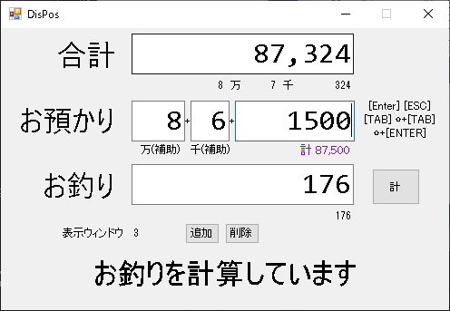
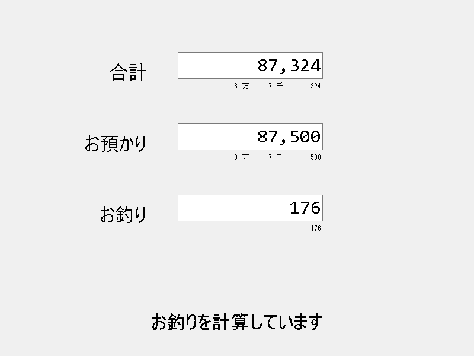

# dispos

ありそうだけど見つからなかったのでサクッと書いてみたシンプルお会計機。
コスメを施してビルドし直せばフリマとか文化祭とかで使えるかも。

## 使い方

### 環境設定
代表的な想定は、PCに小さな外付けディスプレイを1,2個付けたもの。

操作用のディスプレイをメインに指定。
設定 -> システム -> ディスプレイ で出てくる1,2と書かれたディスプレイをクリックしてせんたく -> マルチディスプレイ -> これをメインディスプレイにする

表示用のディスプレイのタスクバーを消す
設定 -> 個人用設定 -> タスクバー -> マルチディスプレイ タスクバーをすべてのディスプレイに表示する -> オフ

さらにメイン以外のディスプレイの解像度を800x600とかの最低のものにする。

### 起動
DisPos.exeを実行。操作パネルの「追加」ボタンを押すと表示パネルが出てくるので、メイン以外のディスプレイに移動して最大化する(しなくてもよい)。
同様に表示パネルを好きなだけ追加して配置。

メインパネルで合計と受け取った額を入力すると、表示パネルでそれが表示される。
Enter とか Shift + Enter とか TAB とか Shift + Tab とかを適当に打ってみると、キーボードだけで便利に使えるかも。

#### メインパネル

#### 表示パネル(全画面表示)

#### 表示パネル(ウィンドウ表示)

